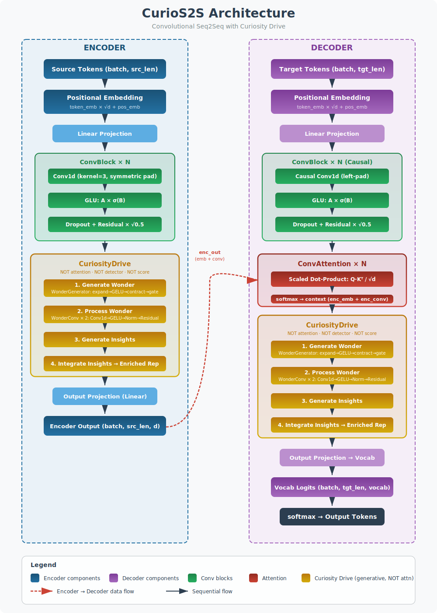

# CurioNet

A curiosity-driven sequence-to-sequence architecture where **curiosity** — not attention — is the primary mechanism.

## Core Idea

Transformers use **attention** (Q·Kᵀ → weighted V) to re-weight existing information. CurioNet uses **curiosity** to **generate new internal states** — wonder, thinking, insights.

| | Transformer | CurioNet |
|---|---|---|
| **Primary mechanism** | Multi-head attention | Curiosity layers |
| **Core operation** | Q·Kᵀ → softmax → weighted V | Wonder → Process → Insights |
| **Self-attention** | Every layer, multi-head | Every N layers, single-head (tiny) |
| **Cross-attention** | Multi-head, every layer | Single-head, minimal |
| **Info sharing** | Re-weights existing info | Generates new info |
| **Philosophy** | "What should I focus on?" | "What am I curious about?" |

## Architecture



> Open `docs/architecture.svg` in a browser for full diagram.

### Curiosity Layer (replaces attention layer)

```
Input → [WonderGenerator] → wonder (new states)
                  ↓
        [WonderConv × 2] → processed wonder ("thinking")
                  ↓
        [InsightExtractor] → insights ("aha!")
                  ↓
        [Gated Integration] → enriched output
```

**NOT attention** — doesn't weight inputs.
**NOT a detector** — doesn't classify patterns.
**NOT a score** — doesn't assign values.
**IS generative** — creates new internal states.

### CurioNet Block (replaces Transformer block)

```
Transformer block:  [Multi-Head Attention → FFN]
CurioNet block:     [Curiosity Layer → FFN]
```

### Tiny Attention (sparse, minimal)

Every `attn_every` (default 3) curiosity blocks, a single-head `TinyAttention` is inserted for basic cross-sequence info sharing. This is NOT the primary mechanism — just a small residual.

## Project Structure

```
Net/
├── config.yaml                # Model/training/dataset configuration
├── requirements.txt           # Python dependencies
├── .gitignore
├── data/
│   ├── wikitext2/             # Downloaded WikiText-2 (auto, gitignored)
│   └── tokenizer.txt          # Built tokenizer vocab (auto, gitignored)
├── curionet/
│   ├── __init__.py            # Package exports
│   ├── model.py               # CurioNet, CurioNetEncoder, CurioNetDecoder, TinyAttention
│   ├── curiosity.py           # CuriosityLayer, CuriosityBlock, WonderGenerator, WonderConv, InsightExtractor
│   ├── transformer.py         # TransformerSeq2Seq (for comparison)
│   ├── tokenizer.py           # CharTokenizer (build/encode/decode/save/load)
│   ├── data.py                # WikiText-2 download via datasets lib, WikiText2Dataset
│   ├── train.py               # train_curionet() — WikiText-2, ~300K params, GPU
│   ├── compare.py             # compare() — benchmark CurioNet vs Transformer on WikiText-2
│   └── chat.py                # Interactive chat with streaming output
├── checkpoints/               # Saved weights (gitignored)
├── plots/                     # Training plots (gitignored)
├── docs/
│   ├── README.md              # This file
│   ├── TODO.md                # Pending tasks
│   ├── CHANGELOG.md           # Version history
│   └── architecture.svg       # Architecture diagram
└── _OLD/                      # Previous CurioS2S version (archived)
```

## Dataset

### Download

WikiText-2 (raw) is downloaded automatically via the HuggingFace **`datasets`** library on first run — no manual download needed.

```python
from datasets import load_dataset
ds = load_dataset("wikitext", "wikitext-2-raw-v1", cache_dir="data/wikitext2")
```

- **Splits**: `train`, `validation`, `test`
- **Cache**: `data/wikitext2/` (gitignored)
- **First run**: downloads ~12MB, extracts and caches locally
- **Subsequent runs**: loads from cache, no network access

### Tokenizer

A `CharTokenizer` is built from the training split on first run:
- Scans all characters in the training text
- Builds vocab: `<pad>`, `<bos>`, `<eos>` + all unique characters
- Saved to `data/tokenizer.txt` (gitignored)
- Loaded from file on subsequent runs

### Task

Text continuation — character-level:
- Text is split into fixed-length chunks (`seq_len=64`)
- Input = first half of chunk, target = second half
- Model learns to predict the continuation of text

## Usage

### Install

```bash
pip install -r requirements.txt
```

### Download Dataset

WikiText-2 downloads automatically on first run of `train` or `compare`. To download it manually beforehand:

```bash
python -c "from datasets import load_dataset; load_dataset('wikitext', 'wikitext-2-raw-v1', cache_dir='data/wikitext2')"
```

This caches the dataset in `data/wikitext2/` so subsequent runs work offline.

### Train CurioNet only

```bash
python -m curionet.train
```

Trains CurioNet on WikiText-2 (~300K params, GPU):
- Saves `checkpoints/curionet_best.pt`, `curionet_latest.pt`
- Generates `plots/curionet_wikitext2.png` (loss, PPL, params)
- Early stopping with patience=4, warmup LR over 5 epochs

### Benchmark: CurioNet vs Transformer

```bash
python -m curionet.compare
```

Trains both models with ~300K params each on WikiText-2, then:
- Evaluates on test set (loss, PPL, inference time)
- Generates `plots/wikitext2_benchmark.png` (train/val loss, val PPL, test PPL, params, inference time)
- Sample generation comparison
- Declares winner with PPL margin

### Chat

```bash
python -m curionet.chat
```

Interactive streaming chat with CurioNet (loads `curionet_best.pt`):
```
You> the first century of the roman
CurioNet> empire was a period of...
```

### Programmatic API

```python
from curionet import CurioNet, CharTokenizer, compare, chat, ask, load_model

# Benchmark both models on WikiText-2
results = compare()

# Or load a trained model
model = load_model()
answer = ask(model, "the first century of")
```

## Configuration

All model and training parameters are in `config.yaml`:

```yaml
curionet:
  dim: 46
  num_layers: 2          # ~300K params total

transformer:
  dim: 64
  num_layers: 2
  num_heads: 4           # ~300K params total

training:
  epochs: 30
  batch_size: 64
  seq_len: 64
  lr: 0.0003
  warmup_epochs: 5
  patience: 4

device: "cuda"
```

## Dependencies

- `torch>=2.0.0`
- `matplotlib>=3.7.0`
- `pyyaml>=6.0`
- `datasets>=2.14.0`
